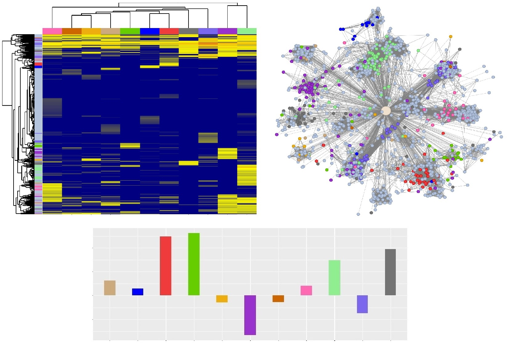

<span style="color:rgb(153, 50, 204);">**C**</span>OMPETING <span style="color:rgb(153, 50, 204);">**E**</span>NDOGENOUS <span style="color:rgb(153, 50, 204);">**R**</span>NA for <span style="color:rgb(153, 50, 204);">**IN**</span>TEGRATIVE <span style="color:rgb(153, 50, 204);">**A**</span>NNOTATIONS
==============================================================================================================================================================================================================================================================================================================

------------------------------------------------------------------------

  

### **Installation**
1. Install the latest version of R (4.0.2) 
2. Install `CERINA` dependencies from CRAN:
```r
install.packages(c("shiny", "shinydashboard", "shinyjs", "shinycssloaders", "shinyBS", "DT", "tidyverse", 
"dendextend", "visNetwork", "heatmaply", "Matrix", "fastcluster", "htmltools", "reshape2", "igraph"))
```
3. `CERINA` can be run with the following command:
```r
shiny::runGitHub("jcardenas14/CERINA")
```

### **Introduction**

The CERINA application was developed as a resource for researchers to
infer circRNA function under the competing endogenous RNA (ceRNA)
framework outlined in Cerina paper. Paired circRNA, linear RNA, and
miRNA expression data across 11 human tissues from ENCODE were analyzed
and integrated using Pareto optimality to rank circRNA-miRNA and
miRNA-linRNA interactions. These rankings are the driving force behind
the Cerina methodology and many of the visualizations/tables users will
encounter in the app. All data has been processed, filtered, and
normalized according to the procedures outlined in the paper.

### **Definitions & assumptions**

#### ***Normalization***

By default, linear RNA and miRNA data are reported using CPM (counts per
million) and circRNA data are reported using SRPBM (spliced reads per
billion mapping). However, users are given the option to visualize all
figures/tables using DESeq2 normalized counts via check-boxes.
Throughout the documentation, we refer to normalized counts (either CPM,
SRPBM, or DESeq2) as expression.

#### ***Tissue specificity***

We defined a circRNA as "tissue specific" if, for a given tissue, it has
mean log2 DESeq2 normalized count ≥ 2 and at least 2 fold higher
expression compared to the second highest expressed tissue. Throughout
CERINA, circRNAs are colored according to their tissue specificity and
are labeled as "unspecific" if the criteria are not met.

#### ***Network edge weights***

Numerous interactions are depicted in CERINA via networks whose edges
have been weighted to reflect the strength of interaction:

-   **circRNA-miRNA** - weighted by pareto interaction score
-   **miRNA-gene** - weighted by pareto interaction score
-   **circRNA-circRNA** - weighted by spearman correlation
-   **circRNA-gene** - weighted by empircal CDF of -log10(pvalue), where
    pvalues are obtained from the gene level permutation test.

All other interactions (i.e. gene-function, miRNA-function,
circRNA-function) have been given the same weight of 1.

#### ***Searching rules***

-   **linear RNA** - Search by Ensembl ID or gene symbol.

-   **miRNA** - Search using 'hsa-xxx-xxx' format.

-   **circRNA** - Search using chromosome location, ciri2 ID, circBase
    ID, circAtlas ID (hg19), or parental gene symbol. When searching by
    gene symbol, an additional input appears listing all circRNAs
    sharing the same parental gene; users can then select a circRNA from
    the list.
